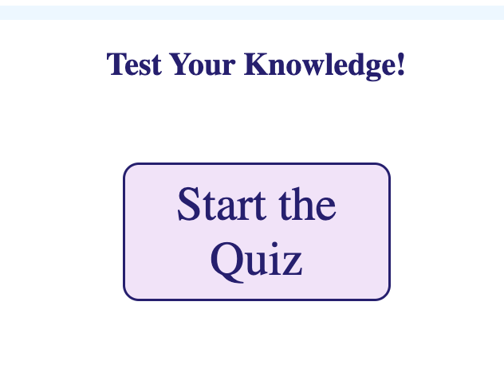
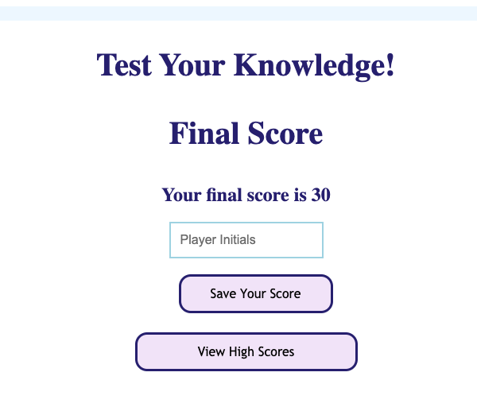

# Timed Coding Quiz

## Purpose
To test the player's knowledge of CSS, Javascript, and HTML coding basics.

## Description
A five question multiple choice quiz about coding.

## How to use
- Click "Start the Quiz" to begin. You will have 60 seconds to answer five multiple choice questions about coding.
- For each question answered incorrectly, 9 seconds will be subtracted from your remaining time.
- Your final score will equal the total number of seconds remaining on the Time when completed.
- Enter your initials to save your final score on the high scores list.

## Link
https://nikcastle.github.io/timed-quiz/

## Quiz Images

## Author
Nikki Castle
with credit to University of Denver Learning Assistants and Tutors